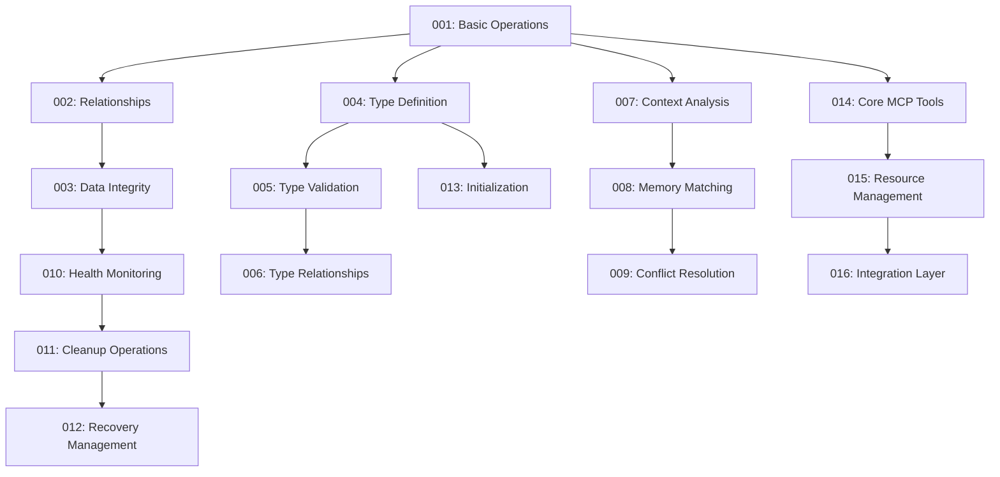

# Memory System Features

## Overview
This directory contains feature specifications for the SQLite-based memory system. Each feature is documented with user stories, acceptance criteria, and technical notes.

## Feature Format
Each feature document includes:
- Description (Problem and Solution)
- User Stories (As a/I want to/So that)
- Acceptance Criteria
- Technical Notes
- Tags
- Complexity Score
- Dependencies (if any)

## Features List

| ID  | Name | Complexity | MVP | Priority | Dependencies |
|-----|------|------------|-----|----------|--------------|
| 001 | Basic Memory Operations | Low (3/10) | ✓ | P0 | None |
| 002 | Memory Relationships | Low (3/10) | ✓ | P0 | 001 |
| 003 | Data Integrity | Medium (4/10) | ✓ | P0 | 001, 002 |
| 004 | Type Definition | Low (3/10) | ✓ | P0 | 001 |
| 005 | Type Validation | Low (3/10) | ✓ | P0 | 004 |
| 006 | Type Relationships | Low (3/10) | ✓ | P0 | 004, 005 |
| 007 | Basic Context Analysis | Low (3/10) | ✓ | P1 | 001 |
| 008 | Memory Matching | Low (3/10) | ✓ | P1 | 001, 007 |
| 009 | Conflict Resolution | Medium (4/10) | ✓ | P1 | 007, 008 |
| 010 | Health Monitoring | Low (3/10) | | P2 | 001, 003 |
| 011 | Cleanup Operations | Low (3/10) | | P2 | 010 |
| 012 | Recovery Management | Low (3/10) | | P2 | 010, 011, 003 |
| 013 | Memory Initialization | Medium (4/10) | ✓ | P1 | 001, 004 |
| 014 | Core MCP Tools | Low (3/10) | ✓ | P1 | 001, 007 |
| 015 | Resource Management | Low (3/10) | ✓ | P1 | 014 |
| 016 | Integration Layer | Low (3/10) | ✓ | P1 | 014, 015 |

## Priority Levels
- P0: Critical path, must be implemented first
- P1: Important, needed for basic system functionality
- P2: Valuable, but can be implemented later
- P3: Nice to have, can be deferred

## Dependency Graph

## Implementation Order
1. Basic Memory Operations (001)
2. Memory Relationships (002)
3. Data Integrity (003)
4. Type Definition (004)
5. Type Validation (005)
6. Type Relationships (006)
7. Basic Context Analysis (007)
8. Memory Matching (008)
9. Conflict Resolution (009)
10. Core MCP Tools (014)
11. Resource Management (015)
12. Integration Layer (016)
13. Memory Initialization (013)
14. Health Monitoring (010)
15. Cleanup Operations (011)
16. Recovery Management (012)

## Feature Groups

### Core Storage Components
- ⚪ Basic Memory Operations (001)
- ⚪ Memory Relationships (002)
- ⚪ Data Integrity (003)

### Type System Components
- ⚪ Type Definition (004)
- ⚪ Type Validation (005)
- ⚪ Type Relationships (006)

### Context Detection Components
- ⚪ Basic Context Analysis (007)
- ⚪ Memory Matching (008)
- ⚪ Conflict Resolution (009)

### Maintenance Components
- ⚪ Health Monitoring (010)
- ⚪ Cleanup Operations (011)
- ⚪ Recovery Management (012)

### MCP Integration Components
- ⚪ Core MCP Tools (014)
- ⚪ Resource Management (015)
- ⚪ Integration Layer (016)

### Additional Features
- ⚪ Memory Initialization (013)

## Testing Approach
- Each feature includes acceptance criteria that form the basis for testing
- User stories provide scenarios for integration testing
- Technical notes guide unit test development
- All features must include both unit and integration tests

## Status Legend
- 🟢 Completed
- 🟡 In Progress
- ⚪ Not Started